# BIAL Hackathon (Prototype Phase)

# Project Title: BIAL-Concierge

> Team: #3stack
>
> Team Members:
> - Naman Mayer
> - Nischith B
> - Pulavarthy Harshik
>

# Tech-Stack

 
 

> Azure Services Used:
>
> 1. Azure CosmosDB
> 1. Azure Functions
> 1. Azure Storage Account
>

 

> Frameworks & Programming Languages Used:
> 
> 1. Flutter & Dart -> User-Interface
> 1. Python -> Azure Functions backend

# User-Interface
Home Screen             | Flights
:-------------------------:|:-------------------------:
  |  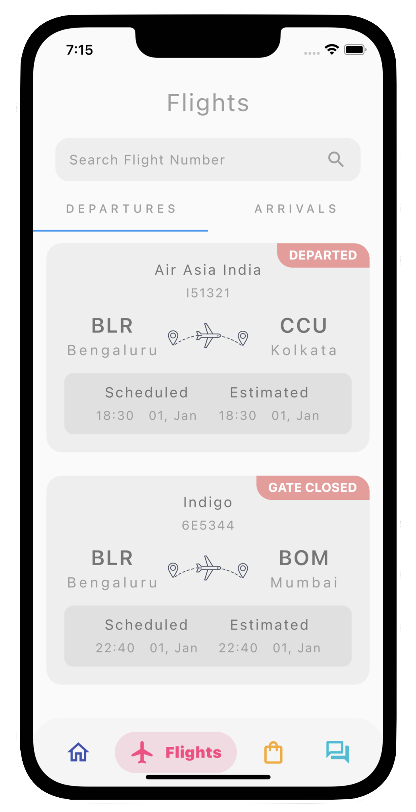

Sign-In Screen             | Sign-up
:-------------------------:|:-------------------------:
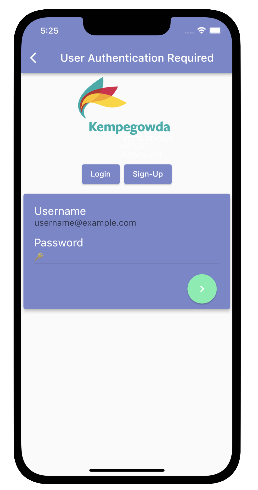  |  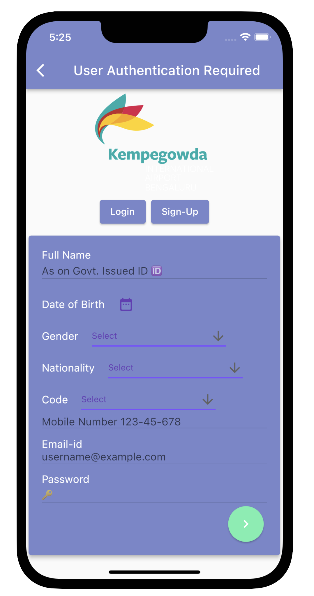

## Chat Bot

Passengers can have various types of questions; some questions need to be answered by an actual human being, but a lot of the queries can be handled by a bot reducing staffing needs of the airport. Also, a bot can be available 24x7

> Chat Bot Commands:
> - Flight Status \<Flight-No> -> Returns the status of the flight
> - Help -> Returns the contact details for medical emergency
> - Tell me something new -> Tells interesting facts about the airport
>

## Customs Declaration

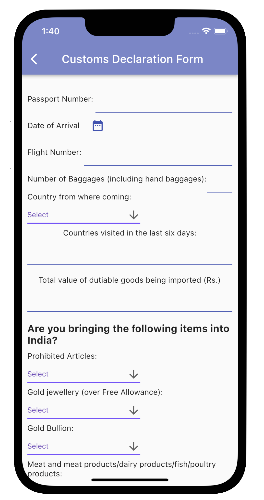 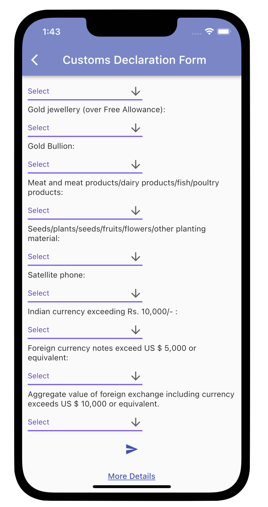

At the end of each international flight the flight crew hands over the customs declaration form to the passengers. Wouldn’t it be convenient if passengers could fill the form using the airport mobile application? It can speed-up the immigration process and make keeping digital records easier.

## In app service requests for Special Assistance to passengers

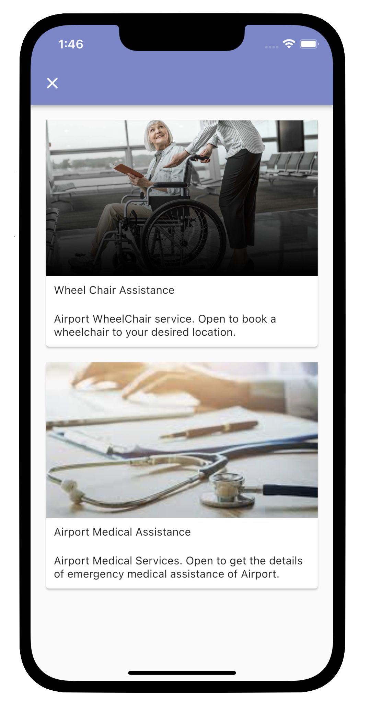 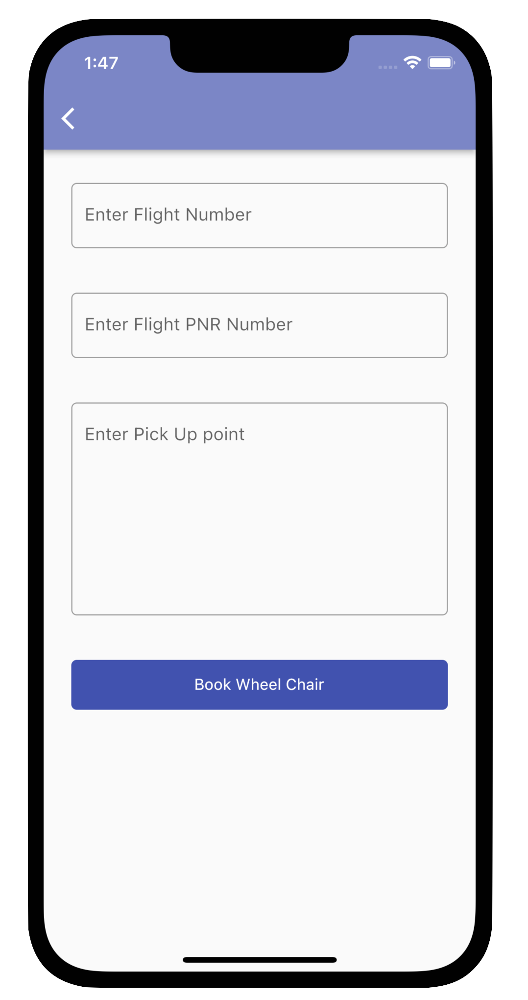

Passengers needing special assistance can request the airport staff using the mobile application, making it convenient for the passengers and airport staff at the same time.

## Airline Contact resources

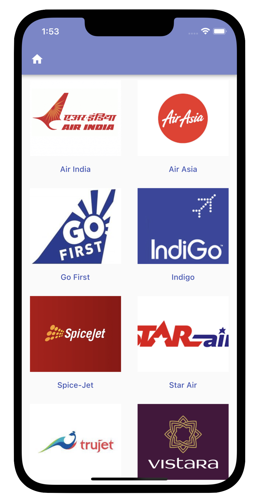

Certain passenger queries require the airline staff and finding the contact resources for the respective airport on the web is not very convenient and therefore a contact resource in the airport application could save valuable time.

## In App-store and Airport rewards

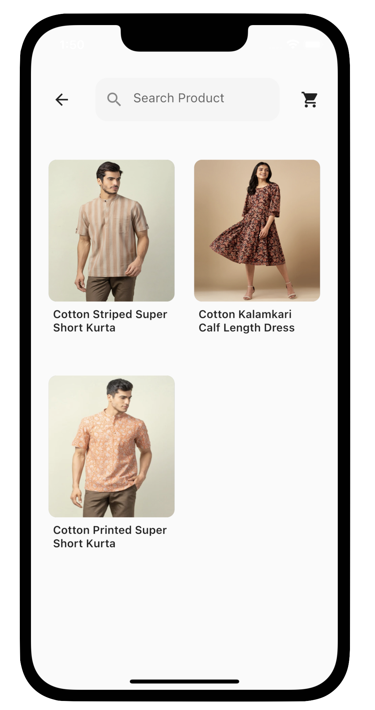 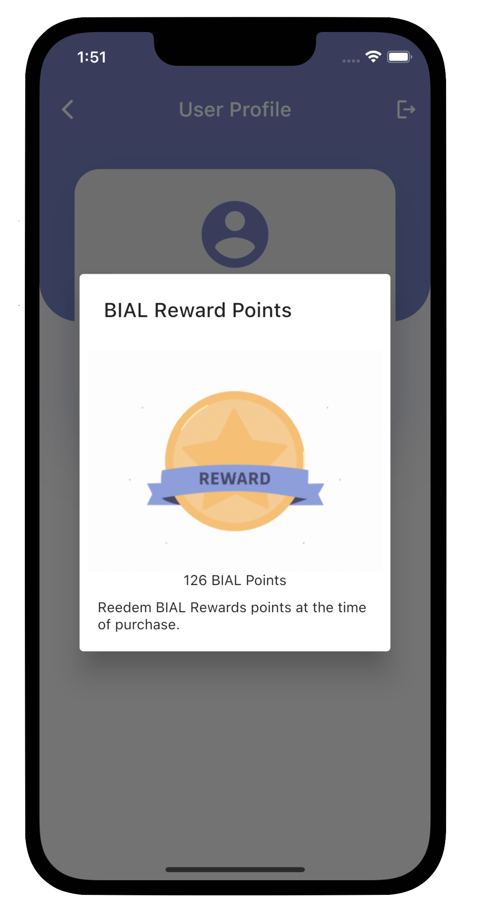

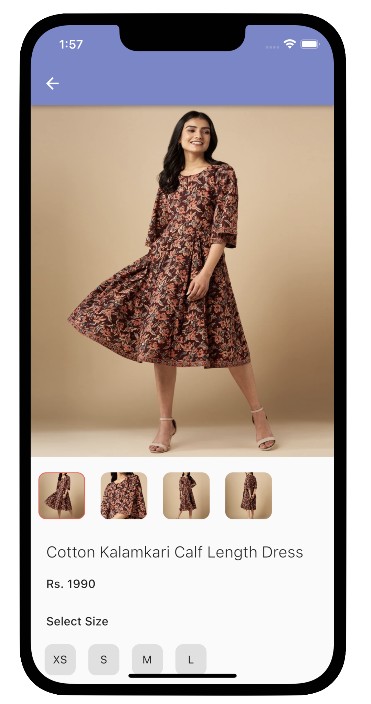 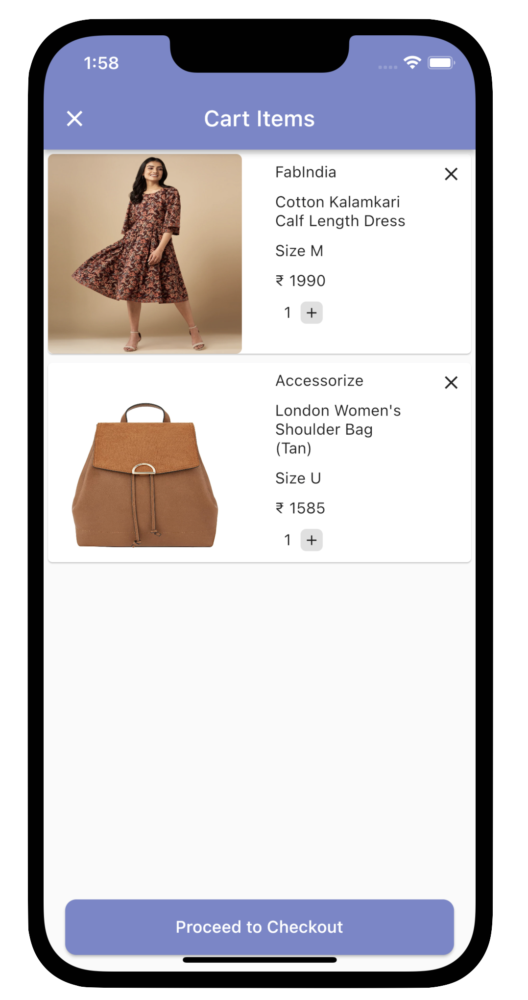

Stores at the airport can choose to have their products added to the in-app store of the application allowing customers to buy the products within the application and then picking up the products from the store itself or getting it delivered somewhere within the airport.

## Feedback / complaint section

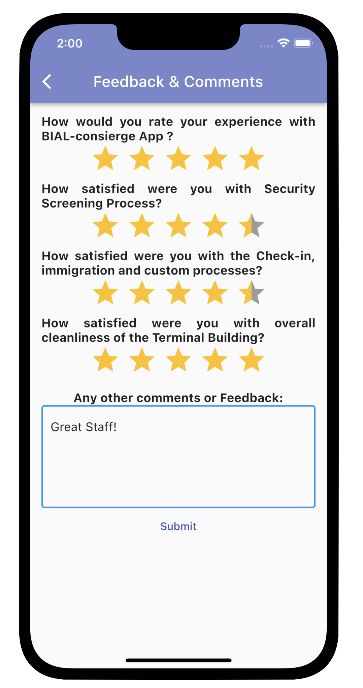

To continuously keep improving the passenger experience, passenger feedbacks are essential. Also, any passenger complaints could be registered using the mobile application making the procedure convenient for passenger and staff.

##  Lost and Found section

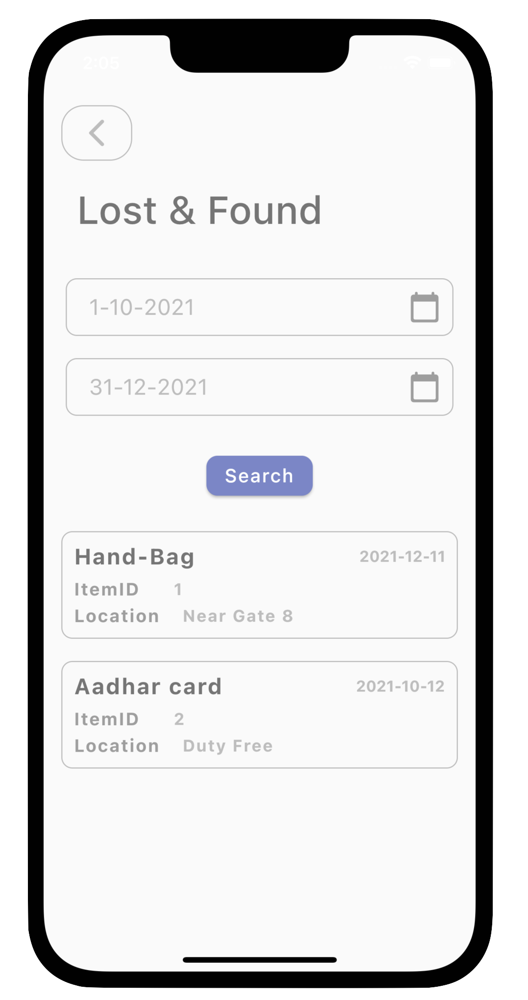 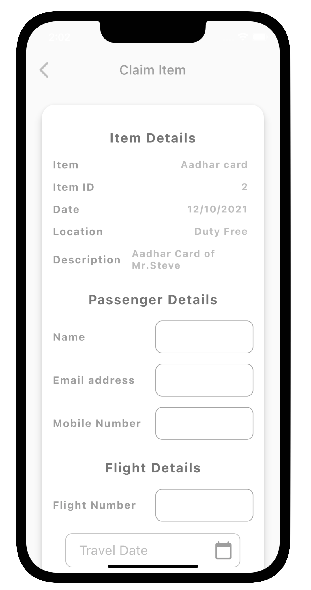

With such large number of passengers visiting the airport everyday there would be many lost or missing items. Therefore, to make the process of reporting and claiming lost items easier we want to have a lost and found section in the application.

## Boarding Pass generation

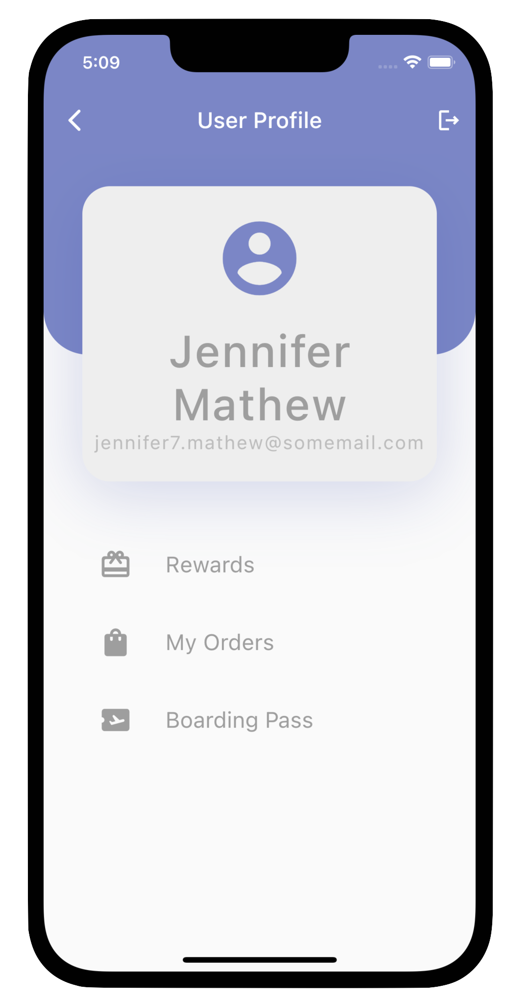 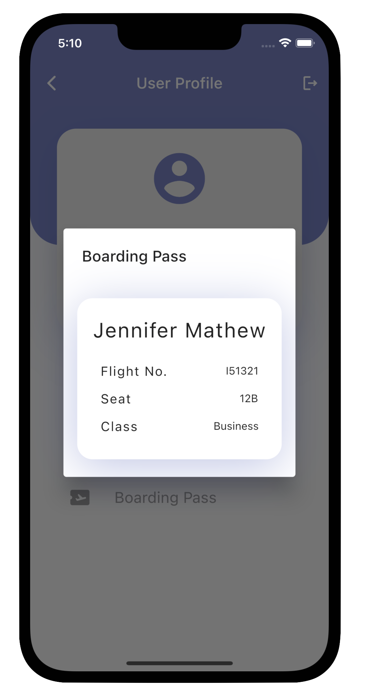

There are always huge queues in front of check in desks at the airport. Despite having machines to allow passengers to self-check-in a lot of the passengers are not very comfortable using them. Having the option to generate an e-boarding pass within the application would make the check-in process convenient.

# Now Lets Talk about the Server-Side

<ul>
<li>All our Backend logic is handled by Azure Functions and the language of our choice is Python</li>
<li>Having a serverless architecture for the prototype meant that we didn't have to manage any servers and using an event-based system would reduce the overall cost.</li>
<li>We used CosmosDB as our database of choice. Its a NoSQL database but accepts SQL like queries. </li>
<li>We used Azure storage account containers to store some of our image resources.</li>
<li>We use JWTs (JSON Web Tokens) on the backend to verify that the requests come from a genuine user and only then perform any further computation</li>
<li>The tokens are generated by the backend system on a successful sign-up or sign-in event and is safely stored on device using flutter_secure_storage plugin</li>
<li>The passwords of users are not stored as plaint text but are hashed using SHA256 algorithm before storing them in cosmosDB</li>
</ul>

